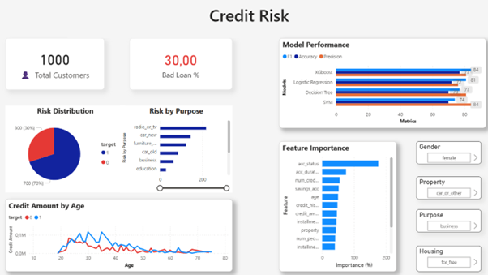

#  Credit Risk Analysis & ML Dashboard



> A machine learning pipeline and interactive Power BI dashboard for predicting **home credit risk** — identifying whether a customer is likely to default on a loan.

---

##  Project Overview

This project was built to assess the creditworthiness of bank customers using real-world-style financial data. It combines multiple ML classification models with a fully interactive Power BI dashboard for business-level insights.

-  **Dataset:** 1,000 customers with financial & demographic features
-  **Target:** Binary classification — Bad Loan (1) vs. Good Loan (0)
-  **Bad Loan Rate:** 30% of customers flagged as high-risk

---

##  ML Models & Performance

| Model               | F1 Score | Accuracy | Precision |
|---------------------|----------|----------|-----------|
| XGBoost             | **84%**  | 77%      | 81%       |
| Logistic Regression | 81%      | 72%      | 76%       |
| Decision Tree       | 77%      | 70%      | 81%       |
| SVM                 | 74%      | 70%      | 84%       |

---

##  Power BI Dashboard Features

- **Risk Distribution** — Pie chart showing good vs bad loan ratio
- **Risk by Purpose** — Bar chart breakdown by loan purpose (car, business, education, etc.)
- **Credit Amount by Age** — Line chart showing borrowing patterns across age groups
- **Feature Importance** — Top predictive features (account status, duration, credit history)
- **Model Performance** — Side-by-side comparison of all 4 ML models
- **Interactive Filters** — Gender, Property, Purpose, Housing type slicers

---

##  Top Predictive Features

1. `acc_status` — Account status
2. `acc_duration` — Account duration
3. `num_credits` — Number of credits
4. `savings_acc` — Savings account balance
5. `age` — Customer age
6. `credit_history` — Past credit behavior

---

##  Project Structure

```
credit-risk/
│
├── credit_risk_data.xlsx     # Raw dataset
├── German_Credit.ipynb         # ML pipeline (EDA, preprocessing, modeling)
├── Credit_Risk_BI.pbix       # Power BI interactive dashboard
├── requirements.txt          # Python dependencies
└── README.md
```

---

##  How to Run

**1. Clone the repository:**
```bash
git clone https://github.com/MahammadBabayevBhos/credit-risk.git
cd credit-risk
```

**2. Install dependencies:**
```bash
pip install -r requirements.txt
```

**3. Run the notebook:**
```bash
jupyter notebook credit_risk.ipynb
```

**4. Open the dashboard:**
- Open `Credit_Risk_BI.pbix` in **Power BI Desktop**

---

##  Tech Stack

- **Python** — pandas, scikit-learn, xgboost, matplotlib, seaborn
- **Power BI Desktop** — Interactive dashboard & data visualization
- **Jupyter Notebook** — EDA and model development

---

##  Author

**Mahammad Babayev**
- GitHub: [@MahammadBabayevBhos](https://github.com/MahammadBabayevBhos)
- Education: Computer Engineering, Baku Higher Oil School
